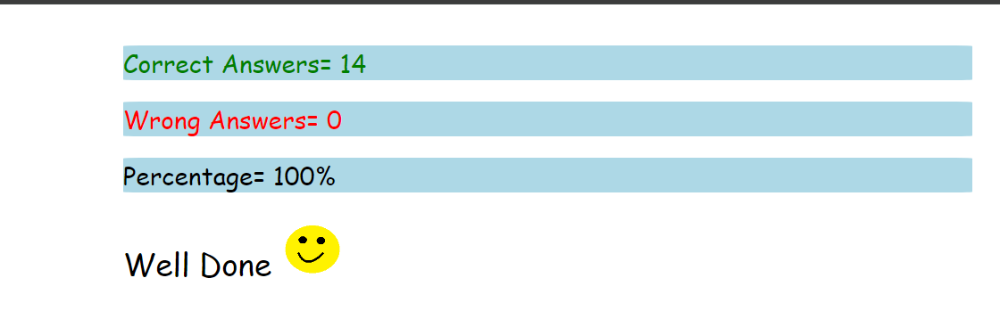

 # JavaScript
 ## Assignment-2

### 1.  What are the variable naming conventions in JavaScript?
#### .variables are case sensitive Hence, we can you upper case and lowercase
#### .variables can be single or multiple character or alphanumeric character
#### .camel casing 
#### .we can use 2 symbols in variables ($,_)
#### .variable cannot start with a number 
#### .dont use keyword as variable 
#### .variable cannot have spaces
 ### 2. Create a greeting alert (use => prompt, message, alert)
 #### let name = prompt("Enter your Name")
 #### let message = "Good Morning "
 #### alert('$ {message} $ {name}') 
  ### 3. Write some code so that the values of the below variables switch around 
 ### Let a = 5, let b = 8. Switch the value so that a holds the value 8 and the variable b holds the value 5
#### let a = 5
#### let b = 8
 #### c = b 
 #### b = a
 #### a = c 
 #### console.log(a);
 #### console.log(b) 
 ## M.C.Q Questions
 